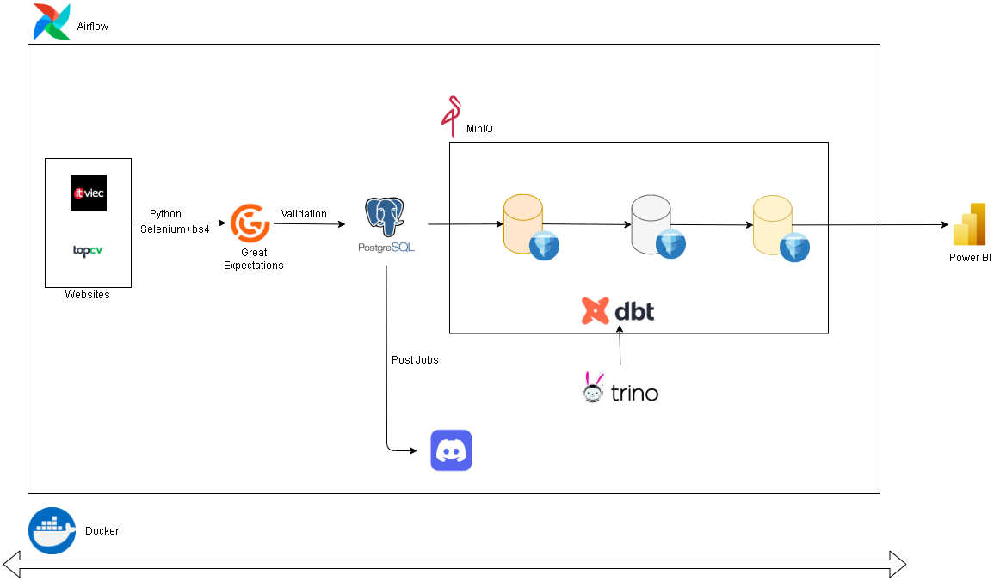
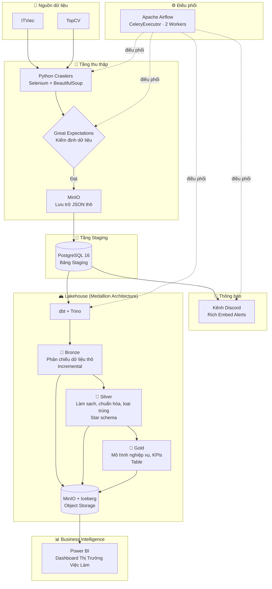
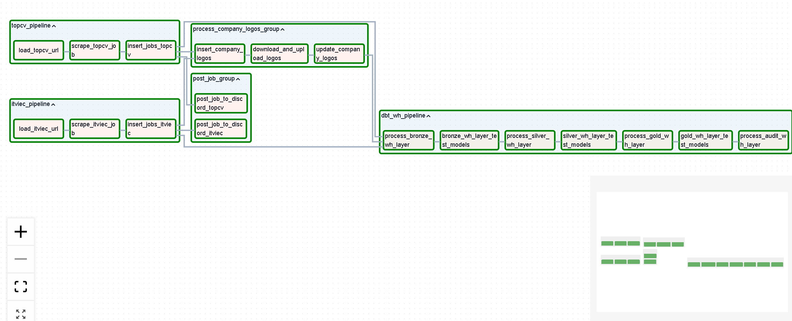
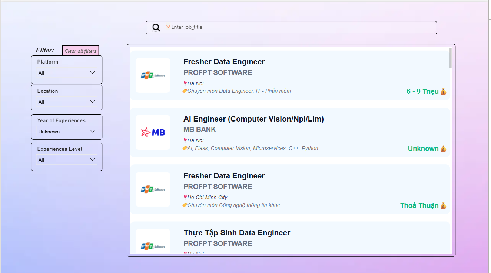
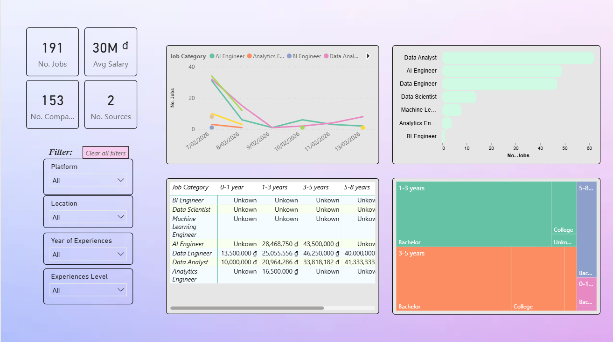
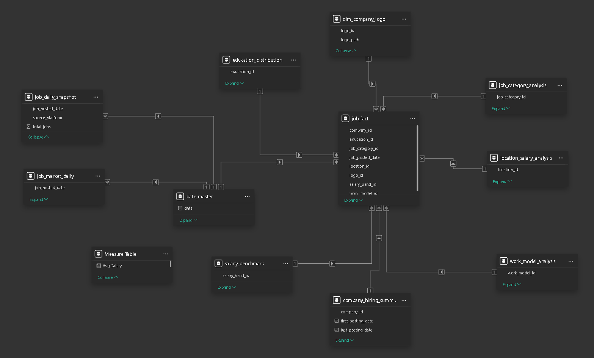

# JobCrawler - Job Market Lakehouse Pipeline

> **JobCrawler - Job Market Lakehouse Pipeline** tự động thu thập tin tuyển dụng từ nhiều nền tảng tuyển dụng Việt Nam, kiểm định chất lượng dữ liệu ngay tại nguồn, gửi thông báo việc làm mới qua Discord, và xây dựng **Lakehouse** hiện đại theo **Medallion Architecture** để phân tích thị trường việc làm trên Power BI.

<p align="center">


</p>



---

## 📌 Mục lục

1. [Bài toán & Động lực](#-bài-toán--động-lực)
2. [Điểm nổi bật](#-điểm-nổi-bật)
3. [Kiến trúc tổng thể](#-kiến-trúc-tổng-thể)
4. [Tech Stack](#-tech-stack)
5. [Luồng dữ liệu chi tiết](#-luồng-dữ-liệu-chi-tiết)
6. [Mô hình dữ liệu dbt — Medallion Architecture](#-mô-hình-dữ-liệu-dbt--medallion-architecture)
7. [Các model phân tích tầng Gold](#-các-model-phân-tích-tầng-gold)
8. [Các quyết định thiết kế & Đánh đổi](#-các-quyết-định-thiết-kế--đánh-đổi)
9. [Task Auditing & Giám sát pipeline](#-task-auditing--giám-sát-pipeline)
10. [Dashboard Power BI](#-dashboard-power-bi)
11. [CI/CD & DevOps](#-cicd--devops)
12. [Cấu trúc dự án](#-cấu-trúc-dự-án)
13. [Hướng dẫn cài đặt & chạy dự án](#-hướng-dẫn-cài-đặt--chạy-dự-án)
14. [Service Endpoints](#-service-endpoints)
15. [Kiểm thử](#-kiểm-thử)
16. [Định hướng phát triển](#-định-hướng-phát-triển)
---

## 🎯 Bài toán & Động lực

Tìm việc trong ngành Data ở Việt Nam đồng nghĩa với việc mỗi ngày phải mở nhiều trang tuyển dụng, lọc thủ công, và rất dễ bỏ sót tin mới. Gần như không có cách nào để có cái nhìn tổng quan về thị trường — kỹ năng nào đang hot, mức lương như thế nào, hay công ty nào đang tuyển nhiều nhất.

**JobCrawl** giải quyết bài toán trên bằng cách:

- **Tự động hóa** việc thu thập tin tuyển dụng từ **ITViec** và **TopCV** (kiến trúc được thiết kế để dễ dàng mở rộng thêm nguồn).
- **Chủ động thông báo** tin mới lên kênh **Discord** — với cơ chế chống trùng lặp, đảm bảo mỗi tin chỉ được đăng đúng một lần.
- **Tích lũy dữ liệu theo thời gian** trong Lakehouse để phân tích **xu hướng thị trường** qua dashboard **Power BI**.

Ngoài giá trị thực tiễn, đây cũng là dự án thực hành **toàn bộ vòng đời của một hệ thống dữ liệu hiện đại**: từ ingestion, validation, orchestration, transformation đến dimensional modeling và BI — tất cả được đóng gói bằng container và sẵn sàng cho production.

---

## 🌟 Điểm nổi bật

| | Tính năng | Chi tiết |
|---|---|---|
| 🔎 | **Crawl tự động đa nguồn** | Selenium + BeautifulSoup với URL cấu hình qua file JSON. Thêm nền tảng mới không cần sửa lõi pipeline. |
| ✅ | **Kiểm định chất lượng dữ liệu trước khi lưu** | Great Expectations validate dữ liệu thô theo từng nguồn *trước khi* vào staging — phát hiện sớm lỗi khi website đổi giao diện. |
| 🔄 | **Upsert & xử lý tăng dần** | `ON CONFLICT` upsert ở staging, incremental materialization ở Bronze — tránh xử lý lại toàn bộ dữ liệu mỗi lần chạy. |
| 📣 | **Cảnh báo Discord idempotent** | Cờ `posted_to_discord` đảm bảo mỗi tin chỉ được đăng đúng một lần, kể cả khi retry hoặc backfill. |
| 🧱 | **Medallion Architecture (Bronze → Silver → Gold)** | Mô hình dbt với phân tách trách nhiệm rõ ràng; mỗi tầng có chuẩn chất lượng và chiến lược materialization riêng. |
| ❄️ | **Lakehouse stack hiện đại** | Apache Iceberg + Trino + MinIO — tách biệt storage khỏi compute, giống các nền tảng dữ liệu đám mây cấp production. |
| 🛠 | **Orchestration module hóa** | Mỗi nguồn dữ liệu có DAG + task group riêng. `master_dag` điều phối toàn bộ pipeline. CeleryExecutor với 2 worker replica để chạy song song. |
| 🔍 | **Auditing ở cấp độ task** | Custom callback ghi nhận trạng thái thực thi, thời gian, số dòng xử lý, và stack trace lỗi vào bảng audit — giám sát pipeline vượt xa Airflow logs. |
| 🖼️ | **Xử lý logo công ty** | Tự động download, upload lên MinIO, và mã hóa base64 logo công ty cho Discord embed và dashboard. |
| 📊 | **12 model phân tích tầng Gold** | Mô hình chiều (star schema) phục vụ phân tích lương, so sánh nền tảng, phân tích địa điểm, phân bố trình độ học vấn, và nhiều hơn nữa. |
| 🐳 | **Một lệnh để chạy tất cả** | ~11 service được điều phối qua Docker Compose + Makefile — PostgreSQL, Airflow (webserver + scheduler + 2 workers), Redis, MinIO, Trino (coordinator + 2 workers), và các container khởi tạo. |
| 🔐 | **CI/CD pipeline** | GitHub Actions cho linting (Black, Flake8, Ruff), quét bảo mật (Bandit, Safety), validate DAG, build Docker image, integration test, và triển khai tự động. |

---

## 🏗️ Kiến trúc tổng thể



---

## 🧰 Tech Stack

| Nhóm | Công nghệ | Vai trò |
|---|---|---|
| **Ngôn ngữ** | Python 3.11, SQL | Logic xử lý chính và transformation |
| **Thu thập dữ liệu** | Selenium, ChromeDriver, BeautifulSoup | Crawl trình duyệt headless kết hợp phân tích HTML |
| **Kiểm định chất lượng** | Great Expectations | Kiểm tra schema và chất lượng dữ liệu theo từng nguồn |
| **Điều phối** | Apache Airflow 2.9 (CeleryExecutor) | Lập lịch DAG, task group, chính sách retry |
| **Hàng đợi task** | Redis | Message broker cho Celery, thực thi task phân tán |
| **CSDL Staging** | PostgreSQL 16 | Lưu trữ vận hành với cơ chế upsert |
| **Object Storage** | MinIO | Lưu trữ S3-compatible cho dữ liệu thô và logo công ty |
| **Table Format** | Apache Iceberg | Giao dịch ACID, schema evolution, time travel |
| **Query Engine** | Trino (Coordinator + 2 Workers) | SQL phân tán trên bảng Iceberg trong MinIO |
| **Transformation** | dbt (dbt-trino adapter) | Medallion Architecture: Bronze → Silver → Gold |
| **Thông báo** | Discord Bot (discord.py) | Cảnh báo việc làm dạng rich embed với throttling |
| **BI & Báo cáo** | Power BI (dự án JobPulse) | Dashboard tương tác với semantic model |
| **CI/CD** | GitHub Actions | Lint, test, quét bảo mật, build, deploy |
| **Quản lý dependency** | Dependabot | Tự động cập nhật dependency hàng tuần |
| **Hạ tầng** | Docker, Docker Compose, Makefile | Triển khai toàn bộ 11+ service bằng một lệnh |

---

## 🔄 Luồng dữ liệu chi tiết

### 1️⃣ Thu thập — Crawl → Validate → Lưu trữ → Staging

**DAG theo nguồn:** `itviec_data_pipeline`, `topcv_data_pipeline`

```
Đọc danh sách URL từ file cấu hình JSON
    → Crawl bằng Selenium + ChromeDriver (headless)
    → Trích xuất thông tin có cấu trúc (tiêu đề, công ty, địa điểm, mức lương, tags, ...)
    → Loại bỏ trùng lặp theo URL
    → Validate bằng Great Expectations (bộ expectation riêng cho từng nguồn)
    → Upload JSON thô lên MinIO (bucket crawled-data, phân vùng theo nguồn/timestamp)
    → Upsert vào bảng staging PostgreSQL (ON CONFLICT theo URL)
```

### 2️⃣ Tầng Staging — PostgreSQL

| Thuộc tính | Chi tiết |
|---|---|
| **Schema** | `staging` |
| **Bảng** | `staging.itviec_data_job`, `staging.topcv_data_job`, `staging.company_logos` |
| **Chống trùng** | Upsert `ON CONFLICT` theo URL việc làm |
| **Cờ idempotency** | Cột `posted_to_discord` ngăn chặn thông báo trùng lặp trên Discord |

### 3️⃣ Cảnh báo Discord — Thông báo thời gian thực

- Truy vấn các tin chưa đăng từ staging → gửi tin nhắn rich embed (tiêu đề, công ty, địa điểm, mức lương, logo)
- Đánh dấu tin đã đăng sau khi gửi thành công
- Tích hợp throttling (0.5s giữa các tin nhắn) và xử lý lỗi
- Tách riêng task cảnh báo theo nguồn để chạy song song

### 4️⃣ Xử lý logo công ty

```
Trích xuất URL logo duy nhất từ các bảng staging
    → Lọc bỏ logo đã xử lý (LEFT JOIN)
    → Download ảnh → nhận diện định dạng → upload lên MinIO (tiền tố logos/)
    → Mã hóa base64 để hiển thị inline
    → Cập nhật bảng company_logos với đường dẫn MinIO
```

### 5️⃣ Transformation trên Lakehouse — dbt + Trino + Iceberg

**Điều phối bởi Master DAG:** `master_job_elt` chạy toàn bộ pipeline:

```
[ITViec Pipeline] ──┐
                    ├──→ [Discord Alerts] ──→ [Xử lý Logo] ──→ [dbt Pipeline]
[TopCV Pipeline] ───┘

dbt Pipeline: Bronze → Test → Silver → Test → Gold → Test → Audit
```

Mỗi tầng dbt chạy xong sẽ chạy test trước khi tiến sang tầng tiếp theo.

### Master DAG of project



---


## 🧱 Mô hình dữ liệu dbt — Medallion Architecture

### Tổng quan các tầng

| Tầng | Thư mục | Mục đích | Materialization | Số model |
|---|---|---|---|---|
| 🥉 **Bronze** | `models/bronze/` | Phản chiếu dữ liệu thô từ staging vào Iceberg, biến đổi tối thiểu | Incremental | `itviec_jobs_raw`, `topcv_jobs_raw` |
| 🥈 **Silver** | `models/silver/` | Làm sạch, chuẩn hóa, loại trùng, làm giàu dữ liệu; xây dựng star schema | Incremental / Table | `fact_jobs`, `dim_company`, `dim_location`, `dim_salary_band`, `dim_work_model`, `dim_education`, `dim_company_logo` + các model cơ sở |
| 🥇 **Gold** | `models/gold/` | Tổng hợp phục vụ nghiệp vụ, KPIs, model phân tích | Table | 12 model phân tích (xem bên dưới) |
| 📋 **Audit** | `models/audit/` | Theo dõi hiệu năng pipeline | Table | `job_elt_summary`, `task_performance` |

### Các biến đổi tại tầng Silver

Tầng Silver là nơi thực hiện phần lớn logic biến đổi phức tạp:

- **Hợp nhất đa nguồn**: Dữ liệu ITViec và TopCV được hợp nhất vào một schema chung
- **Chuẩn hóa địa điểm**: Tên thành phố tiếng Việt được ánh xạ sang tiếng Anh qua seed CSV (`vn_city_mapping.csv`)
- **Phân loại danh mục công việc**: Tiêu đề vị trí được ánh xạ sang danh mục chuẩn qua seed CSV (`job_category_mapping.csv`)
- **Chuẩn hóa mức lương**: Custom dbt macro tính `salary_avg_million` và gán `salary_band` (khoảng lương)
- **Suy luận cấp độ kinh nghiệm**: Custom macro phân tích chuỗi YoE (Years of Experience), chuẩn hóa thành số và phân loại cấp độ (Junior/Mid/Senior/Lead)
- **Chuẩn hóa hình thức làm việc**: Thuật ngữ tiếng Việt và tiếng Anh được chuẩn hóa (Hybrid / Remote / On-Site)
- **Chuẩn hóa loại hình công việc**: Full-time / Part-time / Internship được chuẩn hóa xuyên ngôn ngữ
- **Phân tích yêu cầu học vấn**: Custom macro xác định trình độ học vấn tối thiểu
- **Tách địa điểm (Location explosion)**: Các việc làm nhiều địa điểm được tách thành nhiều dòng qua `CROSS JOIN UNNEST`
- **Liên kết logo công ty**: Logo được join từ bảng company_logos trong staging

### Custom dbt Macro

| Macro | File | Mục đích |
|---|---|---|
| `salary_value` | `salary_macros.sql` | Tính lương trung bình từ min/max |
| `salary_bench` | `salary_macros.sql` | Gán khoảng lương (ví dụ: "10-15M", "15-20M") |
| `yoe_normalized` | `year_of_experience.sql` | Phân tích chuỗi kinh nghiệm → giá trị số |
| `yoe_band` | `year_of_experience.sql` | Ánh xạ YoE sang khoảng kinh nghiệm |
| `yoe_level` | `year_of_experience.sql` | Ánh xạ YoE sang cấp độ (Junior/Mid/Senior/Lead) |
| `least_level_of_education` | `least_level_of_education.sql` | Xác định trình độ học vấn tối thiểu |
| `clean_text` | `clean_text.sql` | Tiện ích làm sạch text |
| `generate_schema_name` | `generate_schema_name.sql` | Đặt tên schema tùy chỉnh cho Trino/Iceberg |

---

## 📊 Các model phân tích tầng Gold

| Model | Mô tả | Chỉ số chính |
|---|---|---|
| `job_fact` | Bảng fact chính liên kết tất cả dimension | Surrogate key qua MD5 hash |
| `job_market_daily` | Xu hướng đăng tin hàng ngày theo nền tảng | Số tin đăng, số công ty, lương TB |
| `job_daily_snapshot` | Ảnh chụp thị trường tại thời điểm | Trạng thái thị trường hàng ngày |
| `company_hiring_summary` | Mô hình tuyển dụng theo công ty | Tổng tin đăng, lương TB, xếp hạng |
| `salary_benchmark` | Phân tích lương theo khoảng với thống kê | TB, trung vị, Q1, Q3, số vị trí |
| `location_salary_analysis` | Lương và hình thức làm việc theo thành phố | Lương TB, % remote, số tin đăng |
| `job_category_analysis` | Nhu cầu và mức lương theo danh mục | Xếp hạng, lương TB, % tổng tin |
| `platform_comparison` | So sánh ITViec vs TopCV | Tổng tin, số công ty, % đăng Discord |
| `education_distribution` | Phân bố yêu cầu học vấn kèm chênh lệch lương | Số tin, lương so với TB thị trường |
| `work_model_analysis` | So sánh Remote / Hybrid / On-Site | Số tin, lương TB, vị trí so với thị trường |
| `master_date` | Dimension thời gian cho time intelligence | Các thuộc tính lịch chuẩn |

Tất cả model đều có **dbt schema test** (not_null, unique, accepted_values) được định nghĩa trong `gold_schema.yml`.

---

## 🧠 Các quyết định thiết kế & Đánh đổi

### 1. Validate trước khi lưu (Great Expectations ở bước pre-staging)

Dữ liệu crawl rất dễ hỏng — chỉ cần website đổi giao diện là pipeline có thể bị lỗi âm thầm. Đặt cổng kiểm định chất lượng *trước* staging đảm bảo các tầng phía sau và dashboard luôn làm việc với dữ liệu đáng tin cậy. Khi validate thất bại, exception được ném ra để kích hoạt retry và audit log trên Airflow, thay vì để dữ liệu lỗi lan truyền âm thầm.

### 2. Idempotency ở mọi điểm quan trọng

- **Staging**: Upsert `ON CONFLICT` đảm bảo chạy lại không tạo dữ liệu trùng
- **Discord**: Cờ `posted_to_discord` ngăn spam thông báo khi retry
- **Bronze**: Incremental materialization bỏ qua các bản ghi đã xử lý

Nhờ vậy, DAG có thể retry, backfill, hoặc trigger lại an toàn mà không có tác dụng phụ.

### 3. Lakehouse thay vì Data Warehouse truyền thống

Iceberg + Trino + MinIO cung cấp kiến trúc Lakehouse cấp production:
- **Tách biệt storage-compute**: Object storage giá rẻ (MinIO) với query engine độc lập, mở rộng được (Trino với 2 workers)
- **Giao dịch ACID**: Iceberg hỗ trợ snapshot isolation và schema evolution
- **Định dạng mở**: Không bị khóa vendor; dữ liệu lưu dạng Parquet trong MinIO

### 4. Medallion Architecture (Bronze → Silver → Gold)

Mỗi tầng có một trách nhiệm duy nhất:
- **Bronze**: Giữ nguyên dữ liệu gốc để có thể tái xử lý khi logic nghiệp vụ thay đổi
- **Silver**: Đảm bảo chất lượng, chuẩn hóa xuyên nguồn, xây dựng star schema
- **Gold**: Tối ưu cho các câu hỏi phân tích cụ thể và hiệu năng dashboard

Khi logic transformation thay đổi, chỉ cần build lại tầng bị ảnh hưởng.

### 5. DAG module hóa theo nguồn

Mỗi nguồn dữ liệu có DAG và task group riêng. `master_dag` chỉ đóng vai trò điều phối. Muốn thêm trang tuyển dụng mới chỉ cần thêm một module pipeline — không ảnh hưởng các nguồn hiện có.

### 6. CeleryExecutor để thực thi task song song

Thay vì dùng SequentialExecutor đơn giản, pipeline sử dụng CeleryExecutor với Redis làm broker và 2 worker replica. Điều này cho phép crawl ITViec và TopCV chạy song song thực sự, giảm đáng kể thời gian xử lý end-to-end.

### 7. Lưu dữ liệu thô vào MinIO trước khi đưa vào PostgreSQL

Dữ liệu JSON crawl được upload lên MinIO (bucket `crawled-data`) trước, sau đó đọc lại để insert vào staging. Cách làm này mang lại:
- **Data lineage**: Dữ liệu crawl gốc được lưu giữ kèm timestamp
- **Tách rời**: Bước crawl và bước insert có thể retry độc lập
- **Gỡ lỗi**: Dữ liệu thô luôn sẵn sàng để kiểm tra

---

## 🔍 Task Auditing & Giám sát pipeline

Mọi task Airflow đều có custom callback (`on_success_callback`, `on_failure_callback`) ghi nhận metadata thực thi chi tiết vào bảng `audit.master_job_elt_audit`:

| Chỉ số theo dõi | Mô tả |
|---|---|
| `task_status` | success / failed |
| `task_duration_seconds` | Thời gian thực thi thực tế |
| `rows_scraped` | Số việc làm đã crawl |
| `rows_inserted` | Số bản ghi insert vào staging |
| `rows_posted_discord` | Số tin nhắn Discord đã gửi |
| `discord_posts_failed` | Số tin Discord gửi thất bại |
| `dbt_command` | Lệnh dbt đầy đủ đã thực thi |
| `dbt_models_run/success/failed` | Thống kê thực thi dbt model |
| `error_message` / `error_type` | Chi tiết lỗi khi task thất bại |
| `exception_traceback` | Stack trace đầy đủ (giới hạn 10KB) |
| `task_retry_count` | Số lần retry đã thực hiện |
| `log_url` | Đường dẫn trực tiếp đến Airflow task log |

Dữ liệu audit này sau đó được mô hình hóa trong dbt (`models/audit/`) thành các bảng `job_elt_summary` và `task_performance` phục vụ phân tích vận hành.

---

## 📊 Dashboard Power BI

Dashboard **JobCrawl** được xây dựng trên tầng **Gold** và phục vụ hai mục đích:

### Tìm việc
- Lọc theo vị trí, địa điểm, khoảng lương, công ty, và hình thức làm việc
- Xem các tin đăng mới nhất kèm đường dẫn trực tiếp




### Phân tích thị trường
- 📈 **Xu hướng tuyển dụng**: Số tin đăng hàng ngày theo nền tảng
- 💰 **Phân tích lương**: Phân bố theo vị trí, địa điểm, và cấp độ kinh nghiệm
- 🏢 **Top công ty tuyển dụng**: Xếp hạng theo số lượng tin đăng
- 🗺️ **Phân bố địa lý**: Mật độ việc làm và mức lương theo thành phố
- 🎓 **Phân tích học vấn**: Phân bố yêu cầu trình độ kèm chênh lệch lương
- 🏠 **Hình thức làm việc**: So sánh Remote vs Hybrid vs On-Site
- 📊 **So sánh nền tảng**: ITViec vs TopCV các chỉ số song song




Dashboard bao gồm color theme tùy chỉnh (`Pastel_ColorTheme.json`) và semantic model (`JobPulse.SemanticModel`) cho các định nghĩa nhất quán.



---

## 🔐 CI/CD & DevOps

### GitHub Actions Pipelines

**CI Pipeline** (`pipeline.yml`) — kích hoạt khi push/PR vào `main` và `develop`:

| Giai đoạn | Công cụ | Mục đích |
|---|---|---|
| Chất lượng code | Black, isort, Flake8, Ruff | Kiểm tra formatting và linting |
| Unit Test | pytest, pytest-cov | Kiểm tra coverage, upload lên Codecov |
| Quét bảo mật | Safety, Bandit | Phân tích lỗ hổng dependency + bảo mật code |
| Build Docker | Buildx, GHCR | Build image đa service với layer caching |
| Validate DAG | `airflow dags validate-all` | Kiểm tra cú pháp tất cả Airflow DAG |
| Integration Test | Docker Compose | Smoke test end-to-end với health check |

**CD Pipeline** (`deploy.yml`) — kích hoạt khi push vào `main` và version tag:

| Giai đoạn | Mục đích |
|---|---|
| Build & Push | Build và push Docker image lên GitHub Container Registry |
| Smoke Test | Khởi động toàn bộ stack, chạy health check và test các endpoint quan trọng |
| Tạo Release | Tự động tạo GitHub Release khi có version tag |

**Dependabot**: Tự động cập nhật dependency hàng tuần cho Python (pip), Docker image, và GitHub Actions trên tất cả service.

---

## 📁 Cấu trúc dự án

```
JobCrawl/
├── airflow/
│   ├── config/
│   │   └── airflow.cfg                    # Cấu hình Airflow
│   ├── dags/
│   │   ├── master_dag.py                  # 🎯 DAG điều phối chính
│   │   ├── job_itviec_pipeline.py         # Pipeline ITViec độc lập
│   │   ├── job_topcv_pipeline.py          # Pipeline TopCV độc lập
│   │   └── dbt_pipeline.py               # Pipeline dbt độc lập
│   ├── dbt/job_warehouse/
│   │   ├── models/
│   │   │   ├── bronze/                    # 🥉 Phản chiếu dữ liệu thô (2 model)
│   │   │   ├── silver/                    # 🥈 Làm sạch & làm giàu (14 model)
│   │   │   ├── gold/                      # 🥇 Phân tích (12 model)
│   │   │   └── audit/                     # 📋 Giám sát (2 model)
│   │   ├── macros/                        # Custom SQL macro (lương, kinh nghiệm, v.v.)
│   │   ├── seeds/                         # Dữ liệu tham chiếu (ánh xạ thành phố, danh mục)
│   │   └── dbt_project.yml               # Cấu hình dbt
│   ├── scripts/
│   │   ├── crawl_scripts/crawl_job/       # Triển khai crawler theo từng nguồn
│   │   ├── utils/
│   │   │   ├── db_conn.py                 # Kết nối PostgreSQL & logic upsert
│   │   │   ├── minio_conn.py              # MinIO S3 client wrapper
│   │   │   ├── sender.py                  # Tích hợp Discord bot
│   │   │   ├── formatter.py               # Định dạng Discord embed
│   │   │   ├── image_processor.py         # Download logo công ty
│   │   │   └── load_crawl_source.py       # Đọc cấu hình JSON
│   │   ├── validation/                    # Bộ expectation Great Expectations theo nguồn
│   │   └── test/                          # Smoke test cho crawler & kết nối
│   ├── tasks/
│   │   ├── tasks_group.py                 # Định nghĩa Airflow TaskGroup
│   │   ├── process_tasks.py               # Logic nghiệp vụ chính (crawl, insert, alert)
│   │   └── audit_tasks.py                 # Custom audit callback (class AuditLogger)
│   ├── entrypoint/
│   │   └── entrypoint_airflow.sh          # Script khởi tạo container
│   └── requirements.txt                   # Dependency Python
├── dashboard/
│   ├── JobPulse.Report/                   # Định nghĩa báo cáo Power BI
│   ├── JobPulse.SemanticModel/            # Semantic model cho các chỉ số nhất quán
│   ├── Pastel_ColorTheme.json             # Color theme tùy chỉnh
│   └── JobPulse.pbip                      # File dự án Power BI
├── postgresql/
│   ├── init_db/                           # SQL khởi tạo database
│   ├── init_schema_table/                 # Định nghĩa schema & bảng staging
│   └── init_wh_catalog/                   # Bảng catalog Trino
├── trino/
│   ├── catalog/                           # Cấu hình catalog Trino (Iceberg, PostgreSQL)
│   ├── etc/                               # Cấu hình JVM, coordinator, worker
│   └── init_schema/                       # Khởi tạo schema Iceberg
├── images/
│   ├── project_architecture.png           # Sơ đồ kiến trúc
│   ├── semantic_model.png                 # Sơ đồ semantic model Power BI
│   └── architecture.drawio               # File nguồn sơ đồ (có thể chỉnh sửa)
├── .github/
│   ├── workflows/
│   │   ├── pipeline.yml                   # CI pipeline (lint, test, build, validate)
│   │   └── deploy.yml                     # CD pipeline (build, smoke test, release)
│   └── dependabot.yml                     # Cập nhật dependency tự động
├── docker-compose.yml                     # 🐳 Định nghĩa toàn bộ stack (~11 service)
├── Dockerfile                             # Image tùy chỉnh Airflow + Chrome + Python
├── Makefile                               # Lệnh tiện ích (up, down, clean, logs)
└── .example.env                           # Template biến môi trường
```

---

## ⚙️ Hướng dẫn cài đặt & chạy dự án

### Yêu cầu

- **Docker** & **Docker Compose** (v2+)
- **Make** (tùy chọn, để dùng lệnh tiện ích)
- **~8 GB RAM** (khuyến nghị — Trino và Airflow workers tiêu tốn nhiều bộ nhớ)

### 1. Clone & Cấu hình

```bash
git clone https://github.com/minhkhoa1511/Job-Crawler.git
cd Job-Crawler

# Sao chép và điền thông tin xác thực
cp .example.env .env
```

Chỉnh sửa `.env` với các giá trị của bạn:

```env
# Discord (cho cảnh báo việc làm)
DISCORD_TOKEN="your_discord_bot_token"
DISCORD_CHANNEL_ID="your_channel_id"

# PostgreSQL & Airflow
DB_USER="your_username"
DB_PASSWORD="your_password"
DB_HOST="postgresql_db"
DB_PORT="5432"
DB_JOB="job_db_sm4x"
DB_AIRFLOW="airflow_db"
DB_TRINO="catalog_wh"
AIRFLOW_WEBSERVER_SECRET_KEY="random_secret_key"

# MinIO
MINIO_USER="minio_user"
MINIO_PASSWORD="minio_password"
```

### 2. Khởi động hệ thống

```bash
make up        # Build image tùy chỉnh & khởi động toàn bộ service
```

Lệnh này sẽ khởi tạo **~11 container**: PostgreSQL, Redis, Airflow (init → webserver → scheduler → 2 workers), MinIO (+ init), Trino (coordinator + 2 workers + init).

### 3. Kích hoạt pipeline

1. Mở **Airflow UI** tại [http://localhost:8080](http://localhost:8080)
2. Bật (unpause) và trigger DAG `master_job_elt`
3. Theo dõi quá trình thực thi trên Airflow Graph view

### 4. Khám phá dữ liệu

| Service | URL | Mục đích |
|---|---|---|
| **Airflow UI** | [http://localhost:8080](http://localhost:8080) | Giám sát & kích hoạt DAG |
| **MinIO Console** | [http://localhost:9001](http://localhost:9001) | Duyệt dữ liệu thô & logo trên object storage |
| **Trino UI** | [http://localhost:8081](http://localhost:8081) | Giám sát query & trạng thái cluster |

### Các lệnh khác

```bash
make down      # Dừng tất cả container (giữ nguyên data volume)
make restart   # Khởi động lại toàn bộ service
make logs      # Theo dõi log container
make ps        # Liệt kê container đang chạy
make clean     # ⚠️ Dọn sạch hoàn toàn: xóa container, image, volume
```

---

## 🌐 Service Endpoints

| Service | Port | Giao thức |
|---|---|---|
| Airflow Webserver | `8080` | HTTP |
| Trino Coordinator | `8081` | HTTP |
| MinIO API | `9000` | S3 |
| MinIO Console | `9001` | HTTP |
| PostgreSQL | `5432` | TCP |
| Redis | `6379` | TCP |

---

## 🧪 Kiểm thử

### Smoke Test (`airflow/scripts/test/`)

| Script | Mục đích |
|---|---|
| `test_crawl_it_viec.py` | Xác nhận crawler ITViec chạy thành công |
| `test_crawl_topcv.py` | Xác nhận crawler TopCV chạy thành công |
| `test_db_conn.py` | Kiểm tra kết nối PostgreSQL và truy vấn cơ bản |
| `minio_conn_test.py` | Kiểm tra kết nối MinIO và thao tác file |
| `gx_test.py` | Kiểm tra bộ validation Great Expectations |
| `send_job.py` | Kiểm tra gửi tin nhắn Discord |
| `ai_text_extract_test.py` | Kiểm tra tiện ích trích xuất văn bản AI |

### Đảm bảo chất lượng dữ liệu

| Tầng | Cơ chế |
|---|---|
| **Pre-staging** | Great Expectations: bộ expectation theo từng nguồn validate schema, nullability, và khoảng giá trị |
| **Silver** | dbt schema test: not_null, unique, accepted_values trên các cột quan trọng |
| **Gold** | dbt schema test trên tất cả model phân tích (`gold_schema.yml`) |

### dbt Test

```bash
# Chạy toàn bộ dbt test (từ bên trong container Airflow)
dbt test --project-dir /opt/airflow/dbt/job_warehouse --profiles-dir /opt/airflow/dbt/job_warehouse

# Tạo và phục vụ tài liệu dbt
dbt docs generate --project-dir /opt/airflow/dbt/job_warehouse --profiles-dir /opt/airflow/dbt/job_warehouse
dbt docs serve --port 8085
```

> **Lưu ý**: Smoke test xác nhận crawler và kết nối **hoạt động end-to-end**. Tính chính xác của dữ liệu được đảm bảo bởi Great Expectations (pre-staging) và dbt test (các tầng transformation). CI pipeline cũng chạy DAG validation và quét bảo mật.

---

## 🔭 Định hướng phát triển

- [ ] Mở rộng thêm nguồn tuyển dụng (LinkedIn, VietnamWorks, CareerBuilder, ...)
- [ ] Bổ sung unit test toàn diện và tăng coverage trên CI
- [ ] Trích xuất kỹ năng từ mô tả công việc bằng NLP để phân tích thị trường sâu hơn
- [ ] Triển khai giám sát data freshness và cảnh báo SLA
- [ ] Thêm kênh thông báo Slack / Telegram
- [ ] Xây dựng REST API cho truy cập tìm kiếm việc làm lập trình
- [ ] Discord chatbot gợi ý việc làm cá nhân hóa 

---
